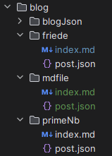

### It's quite simple :

First of all , all the post are added in the **blog** folder and each post is his own folder.

The structure of a post is the following :

The **index.md** file is the file that contains the content of the post and the **post.json** file contains the metadata of the post as the title and the date.

As you can see , posts are written in markdown, it make it easier to write posts.

I can also add images in the post folder and use them in the post.

If I need to add a new post , I just need to add a new folder in the **blog** folder and add the **index.md** and **post.json** files. I just need to update the **blogs.json** file inside the **blogJson** folder to add the new post to the list of posts.